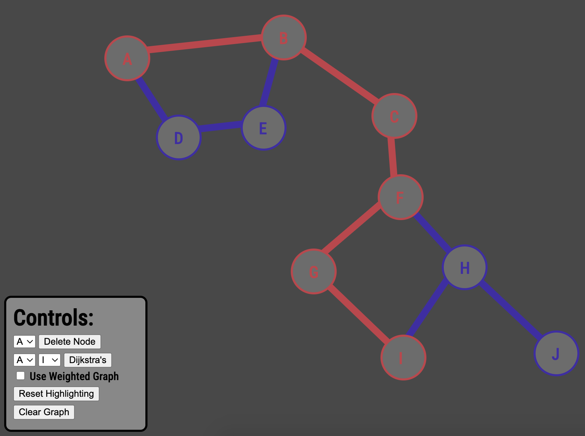

# Dijkstras Visualized 
Over the past couple days I have been playing around with Dijkstra's shortest path algorithm. I used my JS, HTML, and CSS skills to demo it 🚀 
You can create your own dynamic graph with as many nodes as you'd like.

[Check out the live version!](https://people.rit.edu/jgl2651/JACK/Projects/DV/)

## Controls
* **Click** to add nodes.
* **Hold shift** and drag to move them. 
* **Click and drag** to create edges.
* **Use the control panel** to handle specific actions.

### *Here is a screenshot of the UI:*

## TODO / Future Improvements
1. Bug Fixing -- There are some occasional issues with the weighted graph functionality, need to pin that down.
2. Better UI/Colors -- Im not a huge fan of my rather depressing color pallete
3. ~~Setup a live demo!~~ [Done!](https://people.rit.edu/jgl2651/JACK/Projects/DV/)
   
